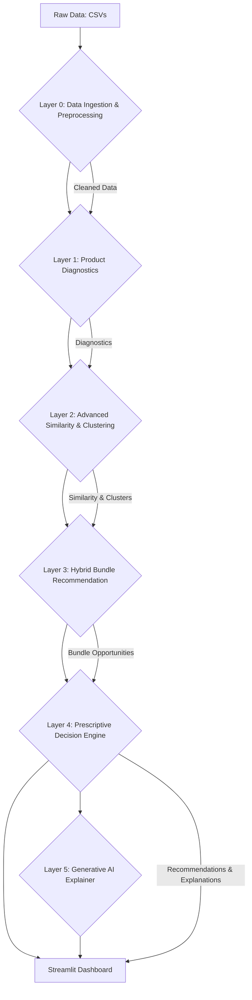

# SPARK – Smart Product Analysis and Recommendation Framework

 <!-- Placeholder for a project logo -->

[](https://www.python.org/)
[](https://streamlit.io/)
[](https://scikit-learn.org/)
[](http://rasbt.github.io/mlxtend/)
[](https://groq.com/)
[](https://opensource.org/licenses/MIT)

## 🚀 Project Overview

**SPARK (Smart Product Analysis and Recommendation Kit)** is a cutting-edge, data-driven decision support system meticulously engineered to empower e-commerce businesses with unparalleled insights into product performance, market opportunities, and intricate customer behavior. Developed as a capstone graduation project, SPARK seamlessly integrates a multi-layered analytical pipeline with state-of-the-art machine learning and generative AI techniques. Its core mission is to provide comprehensive product diagnostics, intelligent recommendations, and transparent, AI-powered explanations, thereby transforming raw data into strategic, actionable intelligence.

In the fiercely competitive digital marketplace, businesses grapple with vast product catalogs and complex customer journeys. SPARK rises to this challenge by offering a holistic solution that not only automates sophisticated data analysis but also translates it into clear, prescriptive guidance. This system is designed to significantly enhance business agility, optimize sales, and foster customer satisfaction by identifying growth avenues and mitigating risks.

## 🎯 Problem Statement

The exponential growth of e-commerce has led to an overwhelming influx of data from diverse sources: transactional records, customer reviews, website interactions, and extensive product catalogs. While this data holds immense potential, extracting actionable insights to drive product strategy, optimize inventory, and personalize customer experiences remains a formidable task. Traditional analytical tools often fall short in:

*   **Pinpointing Underperformance**: Accurately identifying underperforming products and diagnosing their root causes.
*   **Uncovering Latent Relationships**: Discovering subtle yet impactful relationships between products for effective cross-selling and up-selling strategies.
*   **Generating Proactive Recommendations**: Delivering data-backed, tailored recommendations that align with specific business objectives.
*   **Ensuring Interpretability**: Providing clear, trustworthy explanations for analytical findings and recommendations, which is crucial for adoption by non-technical decision-makers.

SPARK directly addresses these critical gaps, offering an intelligent, integrated platform for superior e-commerce analytics.

## 💡 Solution Architecture and Methodology

SPARK is built upon a robust, modular, and extensible architecture, structured into five distinct, interconnected layers. This design philosophy ensures scalability, maintainability, and a clear separation of concerns, facilitating both development and future enhancements.



### 3.1. Layered Analytical Pipeline

**Layer 0: Data Ingestion and Preprocessing**

*   **Purpose**: The foundational layer responsible for ingesting, cleaning, and standardizing raw e-commerce datasets. It ensures data quality and prepares a harmonized dataset for all subsequent analytical stages.
*   **Methodology**: Employs a flexible, schema-agnostic approach with alias mapping to gracefully handle diverse input formats. It performs rigorous data type conversions, imputes missing values, and normalizes textual fields (e.g., advanced Arabic text normalization). The output is a unified `product_master` table, significantly enriched with derived features such as description length, image counts, and product age.
*   **Key Technologies**: Pandas, Custom Python utilities for data pipeline orchestration.

**Layer 1: Product Diagnostics and Performance Analysis**

*   **Purpose**: Provides a deep dive into individual product performance across a spectrum of key e-commerce metrics, identifying areas of strength and weakness.
*   **Methodology**: Constructs a comprehensive funnel analysis (views, cart additions, purchases) to compute critical Key Performance Indicators (KPIs) like conversion rates, cart abandonment rates, and revenue. Products are intelligently classified into performance categories (e.g., 'Strong', 'Moderate', 'Weak') based on statistical thresholds and confidence scores, highlighting underperforming assets.
*   **Key Technologies**: Pandas, NumPy, Advanced statistical analysis techniques.

**Layer 2: Advanced Similarity and Clustering**

*   **Purpose**: Uncovers intricate relationships between products by identifying similar items and their contextual peers, thereby mapping competitive landscapes and market segments.
*   **Methodology**: Constructs a rich, multi-dimensional feature matrix incorporating numerical (e.g., price, conversion rate, brand strength), textual (e.g., description quality score based on category-specific keywords), and categorical (e.g., product category) attributes. **Agglomerative Clustering** with dynamic `k` selection (optimized using the Silhouette Score) is applied to group similar products. **Cosine Similarity** is then leveraged to identify top peer products within each cluster, facilitating detailed competitive analysis and pinpointing specific weaknesses (e.g., price discrepancies, low brand strength, content gaps).
*   **Key Technologies**: Scikit-learn (Agglomerative Clustering, StandardScaler, OneHotEncoder), SciPy (hstack, csr_matrix), Pandas, NumPy.

**Layer 3: Hybrid Bundle Recommendation Engine**

*   **Purpose**: Generates highly intelligent and data-backed product bundle recommendations, unlocking significant cross-selling and up-selling opportunities.
*   **Methodology**: Employs a sophisticated two-tiered strategy:
    *   **Tier-1 FP-Growth**: Utilizes the **FP-Growth algorithm** (from `mlxtend`) on both transactional (order items) and behavioral (event streams) baskets to discover strong statistical associations between products. Rules are filtered by robust thresholds (co-occurrence ≥ 5, lift ≥ 5, confidence ≥ 0.15) to identify truly complementary or substitutable products.
    *   **Tier-2 Category Fallback**: For products not sufficiently covered by Tier-1 rules, a robust fallback mechanism identifies partners within the same category or based on the highest co-occurrence, ensuring comprehensive coverage across the entire product catalog. Bundle scores are dynamically calculated based on lift, confidence, and Jaccard similarity.
*   **Key Technologies**: MLxtend (FP-Growth, Association Rules), Pandas, Custom Python utilities for basket analysis.

**Layer 4: Prescriptive Decision Engine**

*   **Purpose**: The strategic core of SPARK, synthesizing insights from all preceding layers into actionable, prioritized recommendations for business decision-makers.
*   **Methodology**: Fuses diagnostic flags, peer similarity insights, and bundle opportunities into a unified recommendation framework. It intelligently classifies root causes for product underperformance (e.g., `pricing`, `content`, `conversion_friction`, `visibility`, `trust`) and generates specific, bilingual (Arabic/English) recommended actions. A sophisticated weighted priority scoring system categorizes recommendations into 'High', 'Medium', and 'Low' tiers, guiding immediate and impactful business interventions. This layer also meticulously prepares structured data payloads for the Generative AI Explainer.
*   **Key Technologies**: Pandas, Advanced custom Python logic for rule-based decision-making and scoring.

**Layer 5: Generative AI Explainer**

*   **Purpose**: Provides clear, concise, and human-readable executive explanations for the complex analytical recommendations, fostering trust and facilitating rapid adoption.
*   **Methodology**: Leverages a powerful **Large Language Model (LLM)** (specifically `llama-3.3-70b-versatile` via the Groq API) to generate high-quality business explanations. The LLM is meticulously prompted with tightly constrained instructions to ensure it accurately explains *existing* recommendations rather than inventing new metrics or actions. A robust caching mechanism prevents redundant API calls, and a deterministic fallback is provided to ensure system resilience even if the external API is temporarily unavailable.
*   **Key Technologies**: Groq API, Python (for advanced prompt engineering and API interaction).

### 3.2. Interactive Streamlit Dashboard

SPARK culminates in an intuitive and highly interactive dashboard, meticulously crafted with Streamlit. This user-friendly interface provides a dynamic platform for exploring product performance, understanding complex recommendations, and drilling down into specific product insights. The dashboard vividly visualizes key metrics, cluster profiles, similarity networks, and bundle opportunities, making sophisticated analytical results accessible and actionable for all business users.

## ✨ Key Features

*   **Comprehensive Product Performance Diagnostics**: In-depth, funnel-based analysis of product health, pinpointing strengths and weaknesses across critical KPIs.
*   **Intelligent Product Similarity Analysis**: Uncovers competitive landscapes and peer products using advanced clustering and cosine similarity metrics.
*   **Hybrid Bundle Recommendation Engine**: Generates highly effective cross-selling and up-selling opportunities through a two-tiered FP-Growth and category-based fallback mechanism.
*   **Prescriptive Decision Engine**: Translates complex analytical findings into prioritized, actionable business recommendations with clearly identified root causes.
*   **AI-Powered Business Explanations**: Provides clear, human-like explanations for recommendations using Generative AI, significantly enhancing trust and facilitating rapid decision-making.
*   **Interactive Streamlit Dashboard**: A dynamic and user-friendly interface for real-time exploration of insights and recommendations.
*   **End-to-End Analytics Pipeline**: A fully automated, modular pipeline from raw data ingestion to actionable insights and intelligent explanations.

## 📊 Dataset

The project utilizes a comprehensive, simulated e-commerce dataset, meticulously structured across several CSV files. This dataset is designed to faithfully mimic real-world transactional and behavioral data, providing a rich foundation for robust product analysis. The dataset encompasses:

*   `users.csv`: Detailed user demographic and registration information.
*   `products.csv`: An extensive product catalog, including descriptions, categories, and pricing.
*   `orders.csv`: Granular order-level transaction details.
*   `order_items.csv`: Line-item specifics for each order, linking products to transactions.
*   `reviews.csv`: Authentic customer reviews and ratings for products.
*   `events.csv`: Records of user interaction events (e.g., product views, add-to-cart actions, purchases).

These datasets collectively span a significant period from **January 1, 2023, to December 30, 2024**, offering a rich temporal context for analysis.

## 🛠️ Technologies Used

SPARK is built upon a modern, robust, and scalable Python-based data science and web development stack:

*   **Python**: The core programming language orchestrating the entire analytical pipeline and application logic.
*   **Streamlit**: Employed for building the interactive, user-friendly web dashboard, enabling rapid prototyping and deployment.
*   **Pandas**: Indispensable for efficient data manipulation, cleaning, and analysis throughout all layers of the pipeline.
*   **NumPy**: Utilized for high-performance numerical operations and array computing.
*   **Scikit-learn**: A cornerstone for machine learning algorithms, including advanced clustering (Agglomerative Clustering) and data scaling techniques.
*   **Plotly**: Integrated for generating sophisticated, interactive data visualizations within the Streamlit dashboard.
*   **MLxtend**: Leveraged for frequent itemset mining and association rule learning, specifically the FP-Growth algorithm for bundle recommendations.
*   **Groq API**: Provides access to high-performance Large Language Models (LLMs), enabling the Generative AI Explainer (Layer 5).

## 📂 Project Structure

The project adheres to a clear and organized directory structure:

```
SPARK_project/
├── app.py                      # The main Streamlit web application dashboard interface.
├── config.py                   # Centralized configuration file for global constants and parameters.
├── run_pipeline.py             # Command-line interface (CLI) script to execute the full analytical pipeline.
├── requirements.txt            # Lists all Python dependencies required for the project.
├── src/                        # Contains the modular source code for each analytical pipeline layer.
│   ├── layer0_data_processing.py  # Layer 0: Data Ingestion, Cleaning, and Feature Engineering.
│   ├── layer1_diagnostics.py      # Layer 1: Product Performance Diagnostics and KPI Calculation.
│   ├── layer2_similarity.py       # Layer 2: Product Similarity Analysis and Clustering.
│   ├── layer3_bundles.py          # Layer 3: Hybrid Bundle Recommendation Engine.
│   ├── layer4_decision_engine.py  # Layer 4: Prescriptive Decision Engine and Recommendation Prioritization.
│   ├── layer5_genai_explainer.py  # Layer 5: Generative AI-powered Explanations for Recommendations.
│   ├── schemas.py                 # Defines data schemas and alias mappings for robust data handling.
│   └── utils.py                   # Collection of shared utility functions and helpers.
├── outputs/                    # Directory for all generated pipeline outputs and artifacts.
│   ├── layer0/                 # Cleaned datasets and data quality reports.
│   ├── layer1/                 # Diagnostic results, KPI summaries, and product classifications.
│   ├── layer2/                 # Similarity scores, peer product lists, and cluster profiles.
│   ├── layer3/                 # Bundle candidates, network graphs, and opportunity lists.
│   ├── layer4/                 # Prescriptive recommendations, high-priority lists, and dashboard payloads.
│   └── layer5/                 # Cache for AI-generated explanations.
├── data/                       # Stores the raw input datasets (e.g., users.csv, products.csv).
├── README.md                   # This comprehensive project documentation file.
├── .env.example                # Template for environment variables, particularly API keys.
└── .gitignore                  # Specifies intentionally untracked files to ignore by Git.
```

## ⚙️ Installation and Usage

To set up and run the SPARK project locally, follow these detailed steps:

### 8.1. Clone the Repository

Begin by cloning the project repository to your local machine:

```bash
git clone https://github.com/your-username/SPARK_project.git
cd SPARK_project
```
### 8
(Content truncated due to size limit. Use line ranges to read remaining content)
