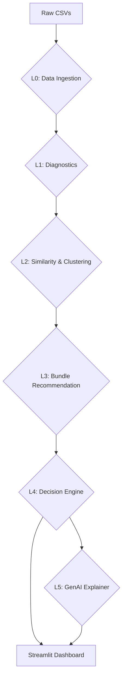

# SPARK – Smart Product Analysis and Recommendation Framework

[](SPARK · Streamlit (https://spark-project.streamlit.app/))
[](https://www.python.org/)
[](https://streamlit.io/)
[](https://scikit-learn.org/)
[](http://rasbt.github.io/mlxtend/)
[](https://groq.com/)

> **Transforming raw e-commerce data into strategic, actionable, and AI-explained business intelligence.**

## 🚀 Project Overview

**SPARK** (Smart Product Analysis and Recommendation Framework) is a sophisticated, data-driven decision support system meticulously crafted for the e-commerce sector. It leverages an advanced analytical pipeline, Machine Learning (ML) algorithms, and Generative AI (GenAI) to deliver comprehensive insights into product performance, identify lucrative cross-selling opportunities, and provide actionable, human-readable business recommendations. This framework empowers businesses to move beyond raw data, transforming it into strategic intelligence that drives growth and optimizes sales.

## 🎯 The Problem SPARK Solves

E-commerce businesses frequently encounter significant challenges in extracting meaningful and actionable insights from their vast and complex datasets. Traditional analytical tools often fall short in addressing critical business needs, leading to missed opportunities and suboptimal decision-making. SPARK directly addresses these pain points by:

*   **Diagnosing Underperformance:** Precisely identifying the underlying reasons *why* a product may not be meeting sales expectations, moving beyond surface-level metrics to root cause analysis.
*   **Mapping Relationships:** Uncovering intricate product relationships to pinpoint the most effective cross-sell and up-sell opportunities, thereby maximizing Average Order Value (AOV).
*   **Providing Actionable Steps:** Translating complex analytical findings into clear, executable business strategies, ensuring that insights lead directly to tangible improvements rather than just data visualization.
*   **Explaining the "Why":** Offering transparent, AI-generated explanations for recommendations, demystifying complex metrics and providing executive summaries that are easy to understand and trust.

## 💡 Architecture & Pipeline

SPARK is built upon a robust, modular 5-layer architecture designed for optimal speed, scalability, and a clear separation of concerns. This layered approach ensures efficient data processing and intelligent insight generation.



Each layer plays a distinct role in the analytical workflow:

*   **Layer 0 - Data Processing (Pandas):** Responsible for ingesting, cleaning, and standardizing diverse e-commerce datasets, consolidating them into a unified master table for subsequent analysis.
*   **Layer 1 - Diagnostics (NumPy/Stats):** Conducts in-depth funnel analysis (tracking views ➔ cart additions ➔ purchases) to calculate key performance indicators (KPIs) and flag underperforming products or assets.
*   **Layer 2 - Clustering (Scikit-learn):** Employs Agglomerative Clustering and Cosine Similarity on multi-dimensional product features to accurately map competitor products and identify peer groups.
*   **Layer 3 - Hybrid Bundles (MLxtend):** Discovers high-conversion cross-sell opportunities through the FP-Growth algorithm, complemented by a robust category fallback mechanism to ensure comprehensive recommendations.
*   **Layer 4 - Decision Engine (Custom Logic):** Integrates insights from the preceding layers to generate prioritized (High, Medium, Low) and bilingual business actions based on identified root causes and opportunities.
*   **Layer 5 - GenAI Explainer (Groq API):** Utilizes the `llama-3.3-70b-versatile` model via the Groq API to translate complex data payloads and analytical findings into clear, concise, and trustworthy executive summaries.

## ✨ Key Features

SPARK offers a suite of powerful features designed to empower e-commerce businesses:

*   **📊 Funnel-Based Diagnostics:** Provides instant health checks and performance assessments for any product within the e-commerce catalog.
*   **🕸 Intelligent Clustering:** Enables the discovery of exact product peers and highlights competitive gaps, offering strategic positioning insights.
*   **🎁 Smart Bundling:** Generates data-backed bundle suggestions, strategically designed to increase the Average Order Value (AOV) and enhance customer purchasing experiences.
*   **🤖 AI Explanations:** Delivers automated, LLM-generated rationales for every recommendation, fostering trust and clarity in decision-making.
*   **💻 Interactive Dashboard:** Offers a dynamic and intuitive Streamlit-powered dashboard for real-time exploration of insights and interactive data visualization.

## 📊 Dataset

The SPARK system is developed and validated using a simulated e-commerce database, encompassing data from January 2023 to December 2024. This comprehensive dataset is structured around six core tables:

*   `users`
*   `products`
*   `orders`
*   `order_items`
*   `reviews`
*   `events`

This rich dataset allows for robust testing and accurate simulation of real-world e-commerce scenarios.

## 🛠 Tech Stack

SPARK is built using a modern and efficient technology stack, ensuring high performance and maintainability:

*   **Python:** The primary programming language for the entire framework.
*   **Streamlit:** Used for creating interactive web applications and dashboards.
*   **Pandas & NumPy:** Essential libraries for data manipulation, analysis, and numerical operations.
*   **Scikit-learn:** A comprehensive machine learning library for clustering and other ML tasks.
*   **Plotly:** Utilized for generating interactive and high-quality data visualizations.
*   **MLxtend:** Provides extensions to popular Python machine learning libraries, specifically used here for association rule mining (FP-Growth).
*   **Groq API:** Integrated for leveraging advanced Generative AI capabilities, specifically the `llama-3.3-70b-versatile` model.

## 📂 Project Structure

The project adheres to a clear and organized directory structure to facilitate development and maintenance:

```
SPARK_project/
├── app.py                      # Main Streamlit dashboard application
├── config.py                   # Global constants, configurations, and parameters
├── run_pipeline.py             # Command-line interface (CLI) script to execute the analytical pipeline
├── requirements.txt            # Lists all Python dependencies required for the project
├── src/                        # Contains the core logic, including Layers 0-5, data schemas, and utility functions
├── outputs/                    # Stores pipeline artifacts, processed datasets, and AI caches
├── data/                       # Holds raw input CSV files for data ingestion
└── .env.example                # Template for environment variables, including API keys
```
